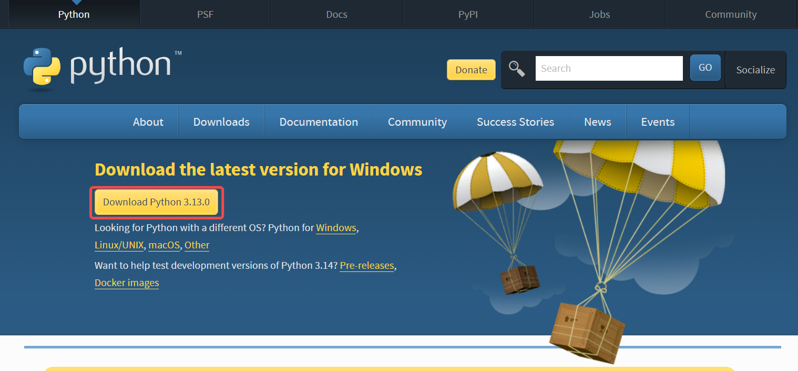
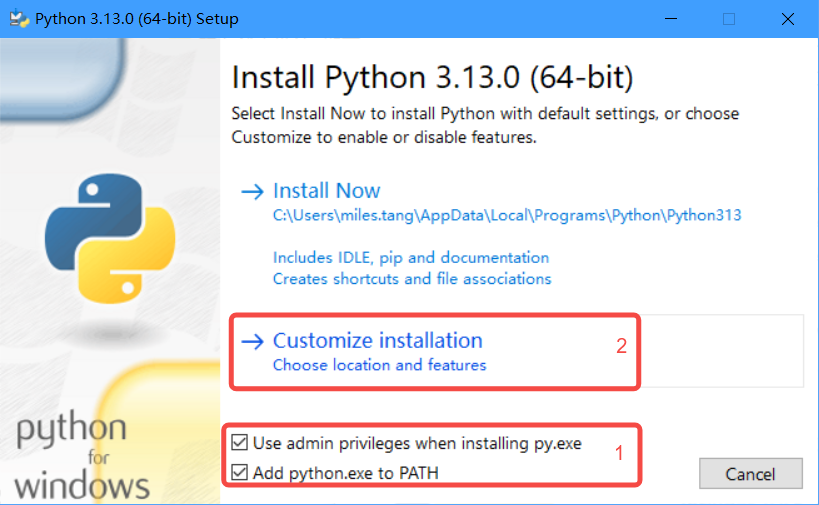
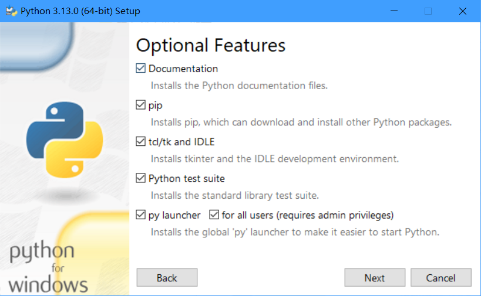
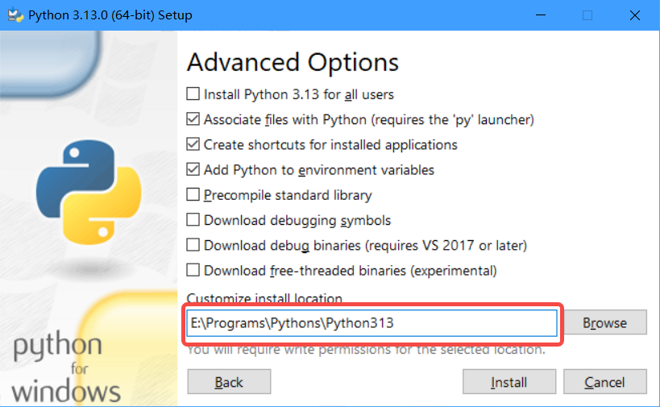
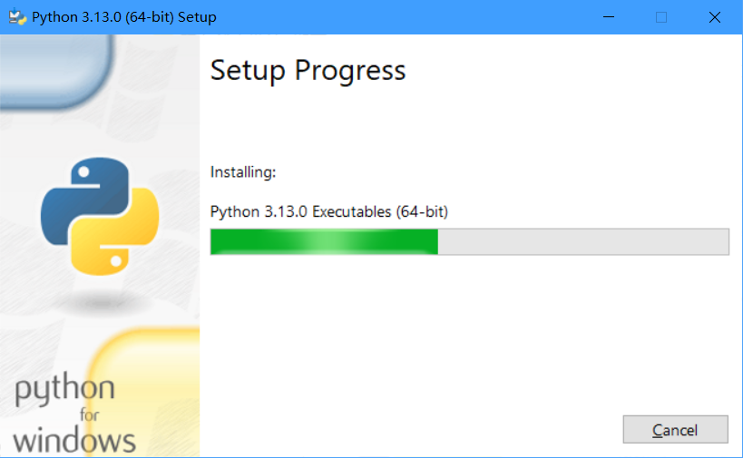
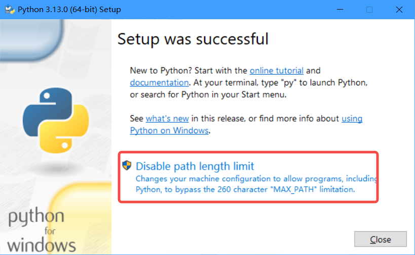
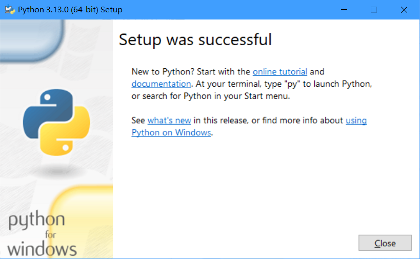
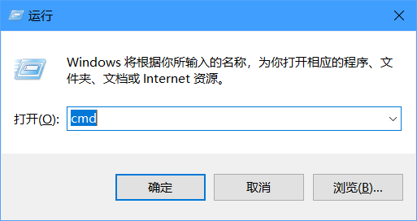
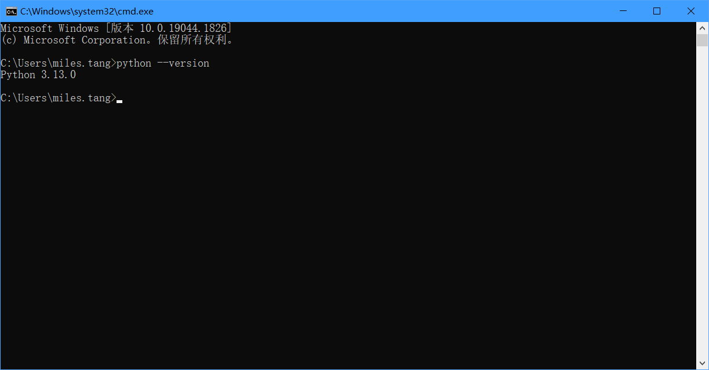

# Python的安装与IDE选择

## 1、下载Python安装包

从[Python Download](https://www.python.org/downloads/)下载对应操作系统的最新的安装程序。下面已经列出哥各个操作系统下载Python的地址：

* [Python Releases for Windows | Python.org](https://www.python.org/downloads/windows/)
* [Python Source Releases | Python.org](https://www.python.org/downloads/source/)
* [Python Releases for macOS | Python.org](https://www.python.org/downloads/macos/)
* [python-devs / ci-images · GitLab](https://gitlab.com/python-devs/ci-images)

## 安装

> 安装的目标路径不要有中文和空格

1. 右键选中安装包（比如我下载的安装包`python-3.13.0-amd64.exe`），在弹出的菜单项选中**以管理员身份运行**，程序会打开安装引导界面，首先得勾选下面两个选项：`Use admin privileges wehen installing py.exe`、`Add python.exe to PATH`，然后选择**Customize installation**，如下图所示：
   

2. 在这个界面的选择项，均保持默认，也就是说直接点击【Next】就可以了。

   

3. 在这个界面中，主要是选择Python的在电脑的哪一个位置，假设我安装的目标路径为：`E:\Programs\Pythons`。那就再输入框配置这个就可以，其它的保持默认选择。然后就可以点击【Install】按钮。

   

4. 点击了【Install】按钮之后，就进入了安装过程，只需等待自己安装完成。

   

5. 安装成功之后会显示如下图所示，新版本增加了一个【Disable path length limit】的按钮，推荐点击：

   

6. 点击了【Disable path length limit】按钮之后，这段内容就不见了，然后就可以点击【Close】按钮关闭，Python已经按照完成了。

   

## 验证

同时按下【Win+R】键，在弹出的一个对话框，输入`cmd`，再点击确定：

然后在CMD命令框中，直接输入`python --version`命令后按回车键，看到如下图所示的信息表示安装成功了。

